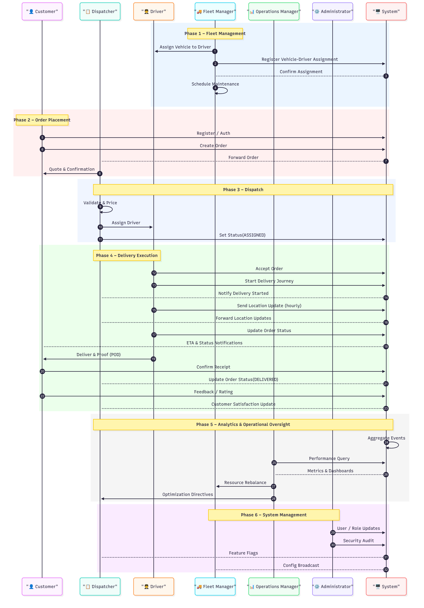

# 🚚 KTC Logistics 2025 Management System

## 📋 Overview

KTC Logistics 2025 is an internal logistics management platform (1PL) designed to fully digitize the transportation process, optimize costs, increase transparency, and support effective management and operation. The system integrates dispatcher order management, fleet management, driver mobile app, and operations dashboard with modern design principles—featuring responsive UI, fluid animations, and 3D visualization—creating a powerful yet intuitive operational tool.

## 🏗️ Architecture & Technology Stack

### 🧩 Clean Architecture & Design System
- **Clean Architecture**: Domain-driven design with separation of concerns
- **Spatial Design System**: Premium glass-morphic UI with consistent components, motion design, and immersive 3D elements across web, mobile, and desktop platforms
- **Responsive & Accessible**: Adaptive to all devices, WCAG 2.1 AA compliant
- **Theme Support**: Seamless dark/light mode transitions

### 💻 Technology Stack
| Category | Technologies |
|----------|--------------|
| **Frontend & Mobile** | React, Next.js, TypeScript, Flutter, Dart |
| **Backend & Database** | Spring Boot (Java 21), PostgreSQL |
| **Maps & Geolocation** | Mapbox, Google Maps API |
| **State Management** | Redux (Web), BLoC (Mobile) |
| **Testing** | Jest, React Testing Library, Flutter Test, JUnit |
| **DevOps** | Docker, Kubernetes, GitHub Actions |

## 🧩 System Components

### 🌐 Landing Page & Customer Portal (Next.js)
- 📱 Interactive service information and user account management
- 🗺️ Real-time order tracking with map visualization
- 📄 Invoice generation and integrated payment processing
- 🚀 Server-side rendering for SEO optimization

### 📊 Admin Dashboard (React.js)
- 📦 Real-time order and fleet management 
- 🚚 AI-assisted route planning and resource allocation
- 📈 Interactive performance analytics and reporting
- 🔄 WebSocket integration for instant updates

### 📱 Driver Mobile App (Flutter)
- 📋 Order management with turn-by-turn navigation
- 📍 Battery-optimized GPS tracking and geofencing
- 📸 Proof of delivery with photo/signature capture
- 📵 Offline-first architecture with data synchronization

### ⚙️ Backend Services (Spring Boot)
- 🔄 RESTful and GraphQL APIs with comprehensive documentation
- 🔐 Multi-factor authentication and authorization
- 🧮 Advanced routing algorithms and analytics engine
- 🏗️ Scalable microservice architecture with caching strategy

## 🔄 End-to-End Workflows

*Detailed workflow showing the interaction between system actors across different operational phases*

## 👥 Role Responsibilities

| Role | Key Responsibilities | Core Activities |
|------|---------------------|-----------------|
| **👤 Customer** | 📦 Order placement & tracking | 📝 Registration, 🛒 order creation, ✅ delivery confirmation |
| **📋 Dispatcher** | 📱 Order allocation & monitoring | 👨‍💼 Driver assignment, ⚠️ exception handling, 📊 reporting |
| **🚚 Fleet Manager** | 🔄 Resource management | 🚗 Vehicle assignment, 📡 telemetry monitoring, 🛣️ route optimization |
| **📊 Operations Manager** | 👓 Process oversight | 📈 Performance monitoring, ⚖️ resource allocation, 📊 analytics |
| **🧑‍✈️ Driver** | 🚛 Delivery execution | ✅ Order acceptance, 🧭 navigation, 📸 delivery verification |
| **⚙️ Administrator** | 🛠️ System maintenance | 👥 User management, ⚙️ configuration, 🔒 security auditing |

## 🧪 Testing & Deployment
- ✅ Comprehensive unit, integration, and E2E testing
- 🔄 Automated CI/CD pipeline with quality gates
- 🐳 Containerization and Infrastructure as Code

## 🔮 Future Roadmap

<table>
  <tr>
    <th>Timeline</th>
    <th>Feature</th>
    <th>Description</th>
  </tr>
  <tr>
    <td rowspan="3">Q4 2025</td>
    <td>🤖 AI Route Optimization</td>
    <td>Machine learning algorithms for optimal route planning</td>
  </tr>
  <tr>
    <td>📱 Mobile App v2.0</td>
    <td>Enhanced UI/UX with augmented reality features</td>
  </tr>
  <tr>
    <td>📊 Redis Cache</td>
    <td>High-performance caching for real-time data access</td>
  </tr>
  <tr>
    <td rowspan="3">Q1 2026</td>
    <td>🧠 Predictive Analytics</td>
    <td>Demand forecasting and resource planning</td>
  </tr>
  <tr>
    <td>🔊 Voice Interface</td>
    <td>Hands-free operation for drivers</td>
  </tr>
  <tr>
    <td>📈 Big Data Infrastructure</td>
    <td>Scalable data lake and processing for operational insights</td>
  </tr>
  <tr>
    <td rowspan="2">Q2 2026</td>
    <td>🌐 International Expansion</td>
    <td>Multi-language support and regional compliance</td>
  </tr>
  <tr>
    <td>🔬 QNN Implementation</td>
    <td>Quantum Neural Networks for next-gen routing optimization</td>
  </tr>
</table>

## 📞 Contact & Support
Technical support: dev@ktclogistics.com | Business inquiries: sales@ktclogistics.com

---

© 2025 KTC Logistics. All rights reserved.
