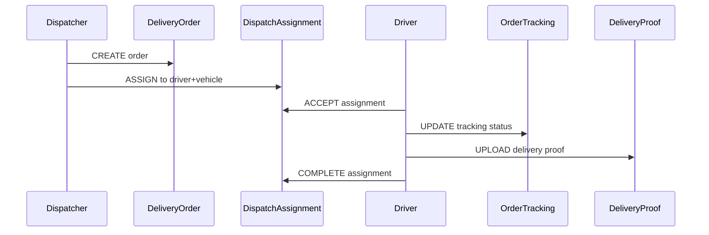
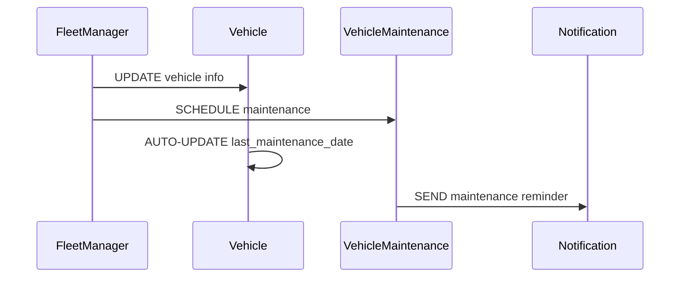
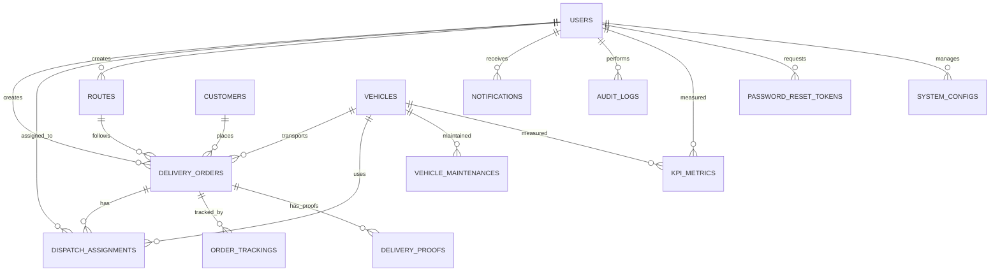

# 📊 KTC LOGISTICS DATABASE - GIẢI THÍCH ENTITIES VÀ MỐI QUAN HỆ

## 📋 TỔNG QUAN HỆ THỐNG

Hệ thống KTC Logistics bao gồm **14 bảng chính** quản lý toàn bộ quy trình vận chuyển từ tạo đơn hàng đến giao hàng hoàn tất.

### 🎯 **Mục tiêu chính:**
- Quản lý đơn hàng giao nhận
- Theo dõi phương tiện và tài xế
- Tối ưu hóa tuyến đường
- Giám sát theo thời gian thực
- Báo cáo và phân tích hiệu suất

---

## 🏗️ CẤU TRÚC CÁC BẢNG CHI TIẾT

### **1. 👥 USERS (Người dùng) - Bảng trung tâm**

```sql
CREATE TABLE users (
    id BIGINT AUTO_INCREMENT PRIMARY KEY,
    name VARCHAR(255) NOT NULL,
    email VARCHAR(255) UNIQUE NOT NULL,
    password VARCHAR(255) NOT NULL,
    role ENUM('ADMIN', 'DISPATCHER', 'DRIVER', 'FLEET_MANAGER', 'OPERATIONS_MANAGER') NOT NULL,
    phone VARCHAR(50),
    address TEXT,
    is_active BOOLEAN NOT NULL DEFAULT TRUE,
    created_at TIMESTAMP DEFAULT CURRENT_TIMESTAMP,
    updated_at TIMESTAMP DEFAULT CURRENT_TIMESTAMP ON UPDATE CURRENT_TIMESTAMP
);
```

#### **📋 Thuộc tính:**
| Thuộc tính | Kiểu dữ liệu | Ràng buộc | Mô tả |
|------------|--------------|-----------|-------|
| `id` | BIGINT | PRIMARY KEY, AUTO_INCREMENT | Khóa chính tự tăng |
| `name` | VARCHAR(255) | NOT NULL | Tên đầy đủ người dùng |
| `email` | VARCHAR(255) | UNIQUE, NOT NULL | Email đăng nhập (duy nhất) |
| `password` | VARCHAR(255) | NOT NULL | Mật khẩu đã được mã hóa |
| `role` | ENUM | NOT NULL | Vai trò trong hệ thống |
| `phone` | VARCHAR(50) | NULLABLE | Số điện thoại liên hệ |
| `address` | TEXT | NULLABLE | Địa chỉ cư trú |
| `is_active` | BOOLEAN | DEFAULT TRUE | Trạng thái hoạt động |
| `created_at` | TIMESTAMP | AUTO | Thời gian tạo tài khoản |
| `updated_at` | TIMESTAMP | AUTO UPDATE | Thời gian cập nhật gần nhất |

#### **🔐 Vai trò (ROLE):**
- **`ADMIN`**: Quản trị viên hệ thống - toàn quyền
- **`DISPATCHER`**: Điều phối viên - tạo và phân công đơn hàng
- **`DRIVER`**: Tài xế - nhận và thực hiện giao hàng
- **`FLEET_MANAGER`**: Quản lý đội xe - quản lý phương tiện
- **`OPERATIONS_MANAGER`**: Quản lý vận hành - giám sát tổng thể

#### **🔗 Mối quan hệ từ USERS:**
- **1-n với delivery_orders** (`created_by`) → Một user tạo nhiều đơn hàng
- **1-n với dispatch_assignments** (`driver_id`) → Một tài xế nhận nhiều nhiệm vụ
- **1-n với routes** (`created_by`) → Một user tạo nhiều tuyến đường
- **1-n với notifications** (`recipient_id`, `sender_id`) → Nhận/gửi thông báo
- **1-n với audit_logs** (`user_id`) → Theo dõi hoạt động của user
- **1-n với vehicle_maintenances** (`creator_id`) → Tạo lịch bảo trì
- **1-n với system_configs** (`created_by`, `updated_by`) → Quản lý cấu hình

---

### **2. 🏢 CUSTOMERS (Khách hàng)**

```sql
CREATE TABLE customers (
    id BIGINT AUTO_INCREMENT PRIMARY KEY,
    name VARCHAR(255) NOT NULL,
    email VARCHAR(255) UNIQUE,
    phone VARCHAR(50) NOT NULL,
    address TEXT,
    company VARCHAR(255),
    contact_person VARCHAR(255),
    is_active BOOLEAN NOT NULL DEFAULT TRUE,
    created_at TIMESTAMP DEFAULT CURRENT_TIMESTAMP,
    updated_at TIMESTAMP DEFAULT CURRENT_TIMESTAMP ON UPDATE CURRENT_TIMESTAMP
);
```

#### **📋 Thuộc tính:**
| Thuộc tính | Kiểu dữ liệu | Ràng buộc | Mô tả |
|------------|--------------|-----------|-------|
| `id` | BIGINT | PRIMARY KEY | Khóa chính khách hàng |
| `name` | VARCHAR(255) | NOT NULL | Tên khách hàng/công ty |
| `email` | VARCHAR(255) | UNIQUE, NULLABLE | Email liên hệ (có thể trống) |
| `phone` | VARCHAR(50) | NOT NULL | Số điện thoại (bắt buộc) |
| `address` | TEXT | NULLABLE | Địa chỉ khách hàng |
| `company` | VARCHAR(255) | NULLABLE | Tên công ty (nếu là B2B) |
| `contact_person` | VARCHAR(255) | NULLABLE | Người liên hệ chính |
| `is_active` | BOOLEAN | DEFAULT TRUE | Trạng thái hoạt động |

#### **🔗 Mối quan hệ:**
- **1-n với delivery_orders** (`customer_id`) → Một khách hàng đặt nhiều đơn hàng

---

### **3. 🚛 VEHICLES (Phương tiện)**

```sql
CREATE TABLE vehicles (
    id BIGINT AUTO_INCREMENT PRIMARY KEY,
    license_plate VARCHAR(20) UNIQUE NOT NULL,
    vehicle_type VARCHAR(100),
    capacity DOUBLE COMMENT 'Tải trọng (tấn)',
    fuel_type VARCHAR(50),
    status ENUM('AVAILABLE', 'IN_USE', 'MAINTENANCE', 'INACTIVE', 'OUT_OF_SERVICE') NOT NULL DEFAULT 'AVAILABLE',
    registration_date TIMESTAMP,
    last_maintenance_date TIMESTAMP,
    created_at TIMESTAMP DEFAULT CURRENT_TIMESTAMP,
    updated_at TIMESTAMP DEFAULT CURRENT_TIMESTAMP ON UPDATE CURRENT_TIMESTAMP
);
```

#### **📋 Thuộc tính:**
| Thuộc tính | Kiểu dữ liệu | Ràng buộc | Mô tả |
|------------|--------------|-----------|-------|
| `id` | BIGINT | PRIMARY KEY | Khóa chính phương tiện |
| `license_plate` | VARCHAR(20) | UNIQUE, NOT NULL | Biển số xe (duy nhất) |
| `vehicle_type` | VARCHAR(100) | NULLABLE | Loại xe (xe tải, xe máy...) |
| `capacity` | DOUBLE | NULLABLE | Tải trọng tối đa (tấn) |
| `fuel_type` | VARCHAR(50) | NULLABLE | Loại nhiên liệu (xăng, dầu, điện) |
| `status` | ENUM | DEFAULT 'AVAILABLE' | Trạng thái hiện tại của xe |
| `registration_date` | TIMESTAMP | NULLABLE | Ngày đăng ký xe |
| `last_maintenance_date` | TIMESTAMP | NULLABLE | Lần bảo trì gần nhất |

#### **🚦 Trạng thái xe (STATUS):**
- **`AVAILABLE`**: Sẵn sàng sử dụng
- **`IN_USE`**: Đang được sử dụng giao hàng
- **`MAINTENANCE`**: Đang bảo trì
- **`INACTIVE`**: Tạm ngừng hoạt động
- **`OUT_OF_SERVICE`**: Hỏng hóc, không sử dụng được

#### **🔗 Mối quan hệ:**
- **1-n với delivery_orders** (`vehicle_id`) → Một xe giao nhiều đơn hàng
- **1-n với dispatch_assignments** (`vehicle_id`) → Một xe được phân công nhiều lần
- **1-n với vehicle_maintenances** (`vehicle_id`) → Một xe có nhiều lần bảo trì
- **1-n với kpi_metrics** (`vehicle_id`) → Theo dõi hiệu suất từng xe

---

### **4. 🗺️ ROUTES (Tuyến đường)**

```sql
CREATE TABLE routes (
    id BIGINT AUTO_INCREMENT PRIMARY KEY,
    name VARCHAR(255) NOT NULL,
    start_address VARCHAR(500) NOT NULL,
    end_address VARCHAR(500) NOT NULL,
    start_latitude DOUBLE,
    start_longitude DOUBLE,
    end_latitude DOUBLE,
    end_longitude DOUBLE,
    estimated_distance DOUBLE COMMENT 'Distance in km',
    estimated_duration INT COMMENT 'Duration in minutes',
    waypoints TEXT COMMENT 'JSON string of waypoints',
    is_optimized BOOLEAN DEFAULT FALSE,
    optimization_score DOUBLE,
    created_at TIMESTAMP DEFAULT CURRENT_TIMESTAMP,
    updated_at TIMESTAMP DEFAULT CURRENT_TIMESTAMP ON UPDATE CURRENT_TIMESTAMP,
    created_by BIGINT,
    FOREIGN KEY (created_by) REFERENCES users(id) ON DELETE SET NULL
);
```

#### **📋 Thuộc tính:**
| Thuộc tính | Kiểu dữ liệu | Ràng buộc | Mô tả |
|------------|--------------|-----------|-------|
| `id` | BIGINT | PRIMARY KEY | Khóa chính tuyến đường |
| `name` | VARCHAR(255) | NOT NULL | Tên tuyến đường |
| `start_address` | VARCHAR(500) | NOT NULL | Địa chỉ điểm đầu |
| `end_address` | VARCHAR(500) | NOT NULL | Địa chỉ điểm cuối |
| `start_latitude` | DOUBLE | NULLABLE | Tọa độ GPS latitude điểm đầu |
| `start_longitude` | DOUBLE | NULLABLE | Tọa độ GPS longitude điểm đầu |
| `end_latitude` | DOUBLE | NULLABLE | Tọa độ GPS latitude điểm cuối |
| `end_longitude` | DOUBLE | NULLABLE | Tọa độ GPS longitude điểm cuối |
| `estimated_distance` | DOUBLE | NULLABLE | Khoảng cách ước tính (km) |
| `estimated_duration` | INT | NULLABLE | Thời gian ước tính (phút) |
| `waypoints` | TEXT | NULLABLE | Các điểm dừng (JSON format) |
| `is_optimized` | BOOLEAN | DEFAULT FALSE | Đã tối ưu hóa chưa |
| `optimization_score` | DOUBLE | NULLABLE | Điểm số tối ưu (0-100) |
| `created_by` | BIGINT | FK → users(id) | Người tạo tuyến đường |

#### **🔗 Mối quan hệ:**
- **n-1 với users** (`created_by`) → Nhiều tuyến được tạo bởi một user
- **1-n với delivery_orders** (`route_id`) → Một tuyến phục vụ nhiều đơn hàng

---

### **5. 📦 DELIVERY_ORDERS (Đơn hàng giao nhận) - Bảng CORE**

```sql
CREATE TABLE delivery_orders (
    id BIGINT AUTO_INCREMENT PRIMARY KEY,
    order_code VARCHAR(100) UNIQUE NOT NULL,
    status ENUM('PENDING', 'ASSIGNED', 'IN_PROGRESS', 'PICKED_UP', 'ON_DELIVERY', 'DELIVERED', 'FAILED', 'CANCELLED') NOT NULL DEFAULT 'PENDING',
    pickup_address VARCHAR(500),
    delivery_address VARCHAR(500) NOT NULL,
    customer_name VARCHAR(255),
    customer_phone VARCHAR(50),
    description TEXT,
    scheduled_time TIMESTAMP,
    actual_delivery_time TIMESTAMP,
    created_at TIMESTAMP DEFAULT CURRENT_TIMESTAMP,
    updated_at TIMESTAMP DEFAULT CURRENT_TIMESTAMP ON UPDATE CURRENT_TIMESTAMP,
    created_by BIGINT,
    vehicle_id BIGINT,
    customer_id BIGINT,
    route_id BIGINT,
    -- Multiple Foreign Keys...
);
```

#### **📋 Thuộc tính:**
| Thuộc tính | Kiểu dữ liệu | Ràng buộc | Mô tả |
|------------|--------------|-----------|-------|
| `id` | BIGINT | PRIMARY KEY | Khóa chính đơn hàng |
| `order_code` | VARCHAR(100) | UNIQUE, NOT NULL | Mã đơn hàng duy nhất |
| `status` | ENUM | DEFAULT 'PENDING' | Trạng thái đơn hàng |
| `pickup_address` | VARCHAR(500) | NULLABLE | Địa chỉ lấy hàng |
| `delivery_address` | VARCHAR(500) | NOT NULL | Địa chỉ giao hàng (bắt buộc) |
| `customer_name` | VARCHAR(255) | NULLABLE | Tên người nhận |
| `customer_phone` | VARCHAR(50) | NULLABLE | SĐT người nhận |
| `description` | TEXT | NULLABLE | Mô tả hàng hóa |
| `scheduled_time` | TIMESTAMP | NULLABLE | Thời gian dự kiến giao |
| `actual_delivery_time` | TIMESTAMP | NULLABLE | Thời gian giao thực tế |
| `created_by` | BIGINT | FK → users(id) | Người tạo đơn hàng |
| `vehicle_id` | BIGINT | FK → vehicles(id) | Xe được phân công |
| `customer_id` | BIGINT | FK → customers(id) | Khách hàng đặt hàng |
| `route_id` | BIGINT | FK → routes(id) | Tuyến đường sử dụng |

#### **📊 Trạng thái đơn hàng (STATUS):**
| Trạng thái | Mô tả | Giai đoạn |
|------------|-------|-----------|
| `PENDING` | Chờ xử lý | Khởi tạo |
| `ASSIGNED` | Đã phân công | Lập kế hoạch |
| `IN_PROGRESS` | Đang thực hiện | Thực thi |
| `PICKED_UP` | Đã lấy hàng | Vận chuyển |
| `ON_DELIVERY` | Đang giao hàng | Vận chuyển |
| `DELIVERED` | Đã giao thành công | Hoàn thành |
| `FAILED` | Giao hàng thất bại | Lỗi |
| `CANCELLED` | Đã hủy | Hủy bỏ |

#### **🔗 Mối quan hệ - DELIVERY_ORDERS là trung tâm:**
- **n-1 với users** (`created_by`) → Nhiều đơn được tạo bởi một user
- **n-1 với customers** (`customer_id`) → Nhiều đơn thuộc về một khách hàng
- **n-1 với vehicles** (`vehicle_id`) → Nhiều đơn được giao bởi một xe
- **n-1 với routes** (`route_id`) → Nhiều đơn sử dụng một tuyến đường
- **1-n với dispatch_assignments** → Một đơn có thể được phân công nhiều lần
- **1-n với order_trackings** → Một đơn có nhiều điểm theo dõi
- **1-n với delivery_proofs** → Một đơn có nhiều bằng chứng giao hàng

---

### **6. 📋 DISPATCH_ASSIGNMENTS (Phân công nhiệm vụ)**

```sql
CREATE TABLE dispatch_assignments (
    id BIGINT AUTO_INCREMENT PRIMARY KEY,
    assigned_at TIMESTAMP DEFAULT CURRENT_TIMESTAMP,
    status ENUM('ASSIGNED', 'ACCEPTED', 'IN_PROGRESS', 'COMPLETED', 'CANCELLED', 'REJECTED') NOT NULL DEFAULT 'ASSIGNED',
    expected_completion_time TIMESTAMP,
    actual_completion_time TIMESTAMP,
    created_at TIMESTAMP DEFAULT CURRENT_TIMESTAMP,
    updated_at TIMESTAMP DEFAULT CURRENT_TIMESTAMP ON UPDATE CURRENT_TIMESTAMP,
    delivery_order_id BIGINT,
    vehicle_id BIGINT,
    driver_id BIGINT,
    -- Foreign Keys with CASCADE/SET NULL rules
);
```

#### **📋 Thuộc tính:**
| Thuộc tính | Kiểu dữ liệu | Ràng buộc | Mô tả |
|------------|--------------|-----------|-------|
| `id` | BIGINT | PRIMARY KEY | Khóa chính phân công |
| `assigned_at` | TIMESTAMP | DEFAULT NOW | Thời gian phân công |
| `status` | ENUM | DEFAULT 'ASSIGNED' | Trạng thái phân công |
| `expected_completion_time` | TIMESTAMP | NULLABLE | Dự kiến hoàn thành |
| `actual_completion_time` | TIMESTAMP | NULLABLE | Thực tế hoàn thành |
| `delivery_order_id` | BIGINT | FK → delivery_orders(id) | Đơn hàng được phân công |
| `vehicle_id` | BIGINT | FK → vehicles(id) | Xe được sử dụng |
| `driver_id` | BIGINT | FK → users(id) | Tài xế được phân công |

#### **🔄 Trạng thái phân công (STATUS):**
| Trạng thái | Mô tả | Hành động tiếp theo |
|------------|-------|---------------------|
| `ASSIGNED` | Đã phân công | Chờ tài xế chấp nhận |
| `ACCEPTED` | Tài xế đã chấp nhận | Bắt đầu thực hiện |
| `IN_PROGRESS` | Đang thực hiện | Tiếp tục giao hàng |
| `COMPLETED` | Hoàn thành | Kết thúc |
| `CANCELLED` | Đã hủy | Phân công lại |
| `REJECTED` | Tài xế từ chối | Tìm tài xế khác |

#### **🔗 Mối quan hệ:**
- **n-1 với delivery_orders** (`delivery_order_id`) → Nhiều phân công cho một đơn
- **n-1 với vehicles** (`vehicle_id`) → Nhiều phân công sử dụng một xe
- **n-1 với users** (`driver_id`) → Nhiều phân công cho một tài xế

---

### **7. 📍 ORDER_TRACKINGS (Theo dõi đơn hàng)**

```sql
CREATE TABLE order_trackings (
    id BIGINT AUTO_INCREMENT PRIMARY KEY,
    status ENUM('ORDER_CREATED', 'ASSIGNED_TO_DRIVER', 'DRIVER_ACCEPTED', 'PICKUP_STARTED', 'PICKED_UP', 'ON_THE_WAY', 'ARRIVED_AT_DESTINATION', 'DELIVERY_ATTEMPTED', 'DELIVERED', 'FAILED_DELIVERY', 'RETURNED') NOT NULL,
    latitude DOUBLE,
    longitude DOUBLE,
    location VARCHAR(500),
    notes TEXT,
    timestamp TIMESTAMP NOT NULL DEFAULT CURRENT_TIMESTAMP,
    created_at TIMESTAMP DEFAULT CURRENT_TIMESTAMP,
    delivery_order_id BIGINT,
    updated_by BIGINT,
    -- Foreign Keys...
);
```

#### **📋 Thuộc tính:**
| Thuộc tính | Kiểu dữ liệu | Ràng buộc | Mô tả |
|------------|--------------|-----------|-------|
| `id` | BIGINT | PRIMARY KEY | Khóa chính tracking |
| `status` | ENUM | NOT NULL | Trạng thái tracking chi tiết |
| `latitude` | DOUBLE | NULLABLE | Tọa độ GPS hiện tại |
| `longitude` | DOUBLE | NULLABLE | Tọa độ GPS hiện tại |
| `location` | VARCHAR(500) | NULLABLE | Mô tả vị trí bằng text |
| `notes` | TEXT | NULLABLE | Ghi chú thêm |
| `timestamp` | TIMESTAMP | NOT NULL | Thời điểm cập nhật |
| `delivery_order_id` | BIGINT | FK → delivery_orders(id) | Đơn hàng được theo dõi |
| `updated_by` | BIGINT | FK → users(id) | Người cập nhật |

#### **🗺️ Trạng thái tracking chi tiết:**
| Trạng thái | Mô tả | Thời điểm |
|------------|-------|-----------|
| `ORDER_CREATED` | Đơn hàng được tạo | Khởi tạo |
| `ASSIGNED_TO_DRIVER` | Đã phân cho tài xế | Phân công |
| `DRIVER_ACCEPTED` | Tài xế chấp nhận | Xác nhận |
| `PICKUP_STARTED` | Bắt đầu đi lấy hàng | Bắt đầu |
| `PICKED_UP` | Đã lấy hàng xong | Lấy hàng |
| `ON_THE_WAY` | Đang trên đường giao | Vận chuyển |
| `ARRIVED_AT_DESTINATION` | Đã đến nơi giao | Đến nơi |
| `DELIVERY_ATTEMPTED` | Đã thử giao hàng | Giao hàng |
| `DELIVERED` | Giao thành công | Hoàn thành |
| `FAILED_DELIVERY` | Giao thất bại | Thất bại |
| `RETURNED` | Trả hàng về | Hoàn trả |

---

### **8. 📸 DELIVERY_PROOFS (Bằng chứng giao hàng)**

```sql
CREATE TABLE delivery_proofs (
    id BIGINT AUTO_INCREMENT PRIMARY KEY,
    proof_type VARCHAR(50) NOT NULL COMMENT 'PHOTO, SIGNATURE, RECEIPT',
    file_path VARCHAR(500),
    file_name VARCHAR(255),
    file_size BIGINT,
    mime_type VARCHAR(100),
    description TEXT,
    recipient_name VARCHAR(255),
    recipient_signature TEXT COMMENT 'Base64 encoded signature',
    captured_at TIMESTAMP DEFAULT CURRENT_TIMESTAMP,
    created_at TIMESTAMP DEFAULT CURRENT_TIMESTAMP,
    delivery_order_id BIGINT NOT NULL,
    uploaded_by BIGINT,
    -- Foreign Keys...
);
```

#### **📋 Thuộc tính:**
| Thuộc tính | Kiểu dữ liệu | Ràng buộc | Mô tả |
|------------|--------------|-----------|-------|
| `id` | BIGINT | PRIMARY KEY | Khóa chính bằng chứng |
| `proof_type` | VARCHAR(50) | NOT NULL | Loại bằng chứng |
| `file_path` | VARCHAR(500) | NULLABLE | Đường dẫn file trên server |
| `file_name` | VARCHAR(255) | NULLABLE | Tên file gốc |
| `file_size` | BIGINT | NULLABLE | Kích thước file (bytes) |
| `mime_type` | VARCHAR(100) | NULLABLE | Loại file (image/jpeg, etc.) |
| `description` | TEXT | NULLABLE | Mô tả bằng chứng |
| `recipient_name` | VARCHAR(255) | NULLABLE | Tên người ký nhận |
| `recipient_signature` | TEXT | NULLABLE | Chữ ký dạng Base64 |
| `captured_at` | TIMESTAMP | DEFAULT NOW | Thời gian chụp/tạo |
| `delivery_order_id` | BIGINT | FK → delivery_orders(id) | Đơn hàng liên quan |
| `uploaded_by` | BIGINT | FK → users(id) | Người upload |

#### **📷 Loại bằng chứng (PROOF_TYPE):**
| Loại | Mô tả | Sử dụng |
|------|-------|---------|
| `PHOTO` | Ảnh chụp hàng hóa | Chứng minh đã giao |
| `SIGNATURE` | Chữ ký người nhận | Xác nhận nhận hàng |
| `RECEIPT` | Biên lai giao hàng | Tài liệu chính thức |

---

### **9. 🔧 VEHICLE_MAINTENANCES (Bảo trì xe)**

```sql
CREATE TABLE vehicle_maintenances (
    id BIGINT AUTO_INCREMENT PRIMARY KEY,
    description TEXT,
    maintenance_date TIMESTAMP DEFAULT CURRENT_TIMESTAMP,
    maintenance_type VARCHAR(50) COMMENT 'SCHEDULED, EMERGENCY, REPAIR',
    cost DOUBLE,
    next_maintenance_date TIMESTAMP,
    created_at TIMESTAMP DEFAULT CURRENT_TIMESTAMP,
    updated_at TIMESTAMP DEFAULT CURRENT_TIMESTAMP ON UPDATE CURRENT_TIMESTAMP,
    vehicle_id BIGINT,
    creator_id BIGINT,
    -- Foreign Keys...
);
```

#### **📋 Thuộc tính:**
| Thuộc tính | Kiểu dữ liệu | Ràng buộc | Mô tả |
|------------|--------------|-----------|-------|
| `id` | BIGINT | PRIMARY KEY | Khóa chính bảo trì |
| `description` | TEXT | NULLABLE | Mô tả công việc bảo trì |
| `maintenance_date` | TIMESTAMP | DEFAULT NOW | Ngày thực hiện bảo trì |
| `maintenance_type` | VARCHAR(50) | NULLABLE | Loại bảo trì |
| `cost` | DOUBLE | NULLABLE | Chi phí bảo trì |
| `next_maintenance_date` | TIMESTAMP | NULLABLE | Lần bảo trì tiếp theo |
| `vehicle_id` | BIGINT | FK → vehicles(id) | Xe được bảo trì |
| `creator_id` | BIGINT | FK → users(id) | Người tạo lịch bảo trì |

#### **🛠️ Loại bảo trì (MAINTENANCE_TYPE):**
| Loại | Mô tả | Tần suất |
|------|-------|----------|
| `SCHEDULED` | Bảo trì định kỳ | Theo lịch |
| `EMERGENCY` | Bảo trì khẩn cấp | Khi cần thiết |
| `REPAIR` | Sửa chữa | Khi hỏng hóc |

---

### **10. 🔔 NOTIFICATIONS (Thông báo)**

```sql
CREATE TABLE notifications (
    id BIGINT AUTO_INCREMENT PRIMARY KEY,
    title VARCHAR(255) NOT NULL,
    content TEXT,
    notification_type VARCHAR(100) COMMENT 'ORDER_ASSIGNED, DELIVERY_COMPLETED, MAINTENANCE_DUE, etc.',
    priority_level VARCHAR(20) COMMENT 'LOW, MEDIUM, HIGH, URGENT',
    is_read BOOLEAN DEFAULT FALSE,
    read_at TIMESTAMP NULL,
    scheduled_at TIMESTAMP,
    sent_at TIMESTAMP,
    created_at TIMESTAMP DEFAULT CURRENT_TIMESTAMP,
    entity_type VARCHAR(100) COMMENT 'DeliveryOrder, Vehicle, User, etc.',
    entity_id BIGINT,
    action_url TEXT COMMENT 'URL to navigate when clicked',
    recipient_id BIGINT NOT NULL,
    sender_id BIGINT,
    -- Foreign Keys...
);
```

#### **📋 Thuộc tính:**
| Thuộc tính | Kiểu dữ liệu | Ràng buộc | Mô tả |
|------------|--------------|-----------|-------|
| `id` | BIGINT | PRIMARY KEY | Khóa chính thông báo |
| `title` | VARCHAR(255) | NOT NULL | Tiêu đề thông báo |
| `content` | TEXT | NULLABLE | Nội dung chi tiết |
| `notification_type` | VARCHAR(100) | NULLABLE | Loại thông báo |
| `priority_level` | VARCHAR(20) | NULLABLE | Mức độ ưu tiên |
| `is_read` | BOOLEAN | DEFAULT FALSE | Đã đọc chưa |
| `read_at` | TIMESTAMP | NULLABLE | Thời gian đọc |
| `scheduled_at` | TIMESTAMP | NULLABLE | Lên lịch gửi |
| `sent_at` | TIMESTAMP | NULLABLE | Thời gian gửi thực tế |
| `entity_type` | VARCHAR(100) | NULLABLE | Loại đối tượng liên quan |
| `entity_id` | BIGINT | NULLABLE | ID đối tượng liên quan |
| `action_url` | TEXT | NULLABLE | Link hành động |
| `recipient_id` | BIGINT | FK → users(id) | Người nhận (bắt buộc) |
| `sender_id` | BIGINT | FK → users(id) | Người gửi |

#### **📢 Loại thông báo (NOTIFICATION_TYPE):**
| Loại | Mô tả | Đối tượng |
|------|-------|-----------|
| `ORDER_ASSIGNED` | Đơn hàng được phân công | Tài xế |
| `DELIVERY_COMPLETED` | Giao hàng hoàn thành | Dispatcher |
| `MAINTENANCE_DUE` | Đến hạn bảo trì | Fleet Manager |
| `SYSTEM_ALERT` | Cảnh báo hệ thống | Admin |

#### **⚡ Mức độ ưu tiên (PRIORITY_LEVEL):**
| Mức độ | Mô tả | Thời gian phản hồi |
|--------|-------|--------------------|
| `LOW` | Thấp | 24 giờ |
| `MEDIUM` | Trung bình | 8 giờ |
| `HIGH` | Cao | 2 giờ |
| `URGENT` | Khẩn cấp | Ngay lập tức |

---

### **11. 📊 KPI_METRICS (Chỉ số hiệu suất)**

#### **📋 Thuộc tính:**
| Thuộc tính | Kiểu dữ liệu | Ràng buộc | Mô tả |
|------------|--------------|-----------|-------|
| `id` | BIGINT | PRIMARY KEY | Khóa chính KPI |
| `metric_name` | VARCHAR(255) | NOT NULL | Tên chỉ số |
| `metric_value` | DOUBLE | NOT NULL | Giá trị chỉ số |
| `metric_unit` | VARCHAR(50) | NULLABLE | Đơn vị đo |
| `calculation_date` | DATE | NOT NULL | Ngày tính toán |
| `period_type` | VARCHAR(20) | NULLABLE | Loại chu kỳ |
| `period_start` | DATE | NULLABLE | Ngày bắt đầu chu kỳ |
| `period_end` | DATE | NULLABLE | Ngày kết thúc chu kỳ |
| `details` | TEXT | NULLABLE | Chi tiết tính toán (JSON) |
| `user_id` | BIGINT | FK → users(id) | Chỉ số của user |
| `vehicle_id` | BIGINT | FK → vehicles(id) | Chỉ số của xe |

#### **📈 Các KPI quan trọng:**
| Tên KPI | Đơn vị | Mô tả |
|---------|--------|-------|
| `DELIVERY_SUCCESS_RATE` | % | Tỷ lệ giao hàng thành công |
| `AVG_DELIVERY_TIME` | Phút | Thời gian giao hàng trung bình |
| `FUEL_EFFICIENCY` | L/100km | Hiệu suất nhiên liệu |
| `DRIVER_PERFORMANCE` | Điểm | Đánh giá tài xế |

---

### **12. 📝 AUDIT_LOGS (Nhật ký hoạt động)**

#### **📋 Thuộc tính:**
| Thuộc tính | Kiểu dữ liệu | Ràng buộc | Mô tả |
|------------|--------------|-----------|-------|
| `id` | BIGINT | PRIMARY KEY | Khóa chính log |
| `action` | VARCHAR(100) | NOT NULL | Hành động thực hiện |
| `entity_type` | VARCHAR(100) | NULLABLE | Loại đối tượng |
| `entity_id` | BIGINT | NULLABLE | ID đối tượng |
| `details` | TEXT | NULLABLE | Chi tiết thay đổi (JSON) |
| `ip_address` | VARCHAR(45) | NULLABLE | Địa chỉ IP |
| `user_agent` | TEXT | NULLABLE | Thông tin trình duyệt |
| `timestamp` | TIMESTAMP | NOT NULL | Thời gian thực hiện |
| `user_id` | BIGINT | FK → users(id) | Người thực hiện |

#### **🔍 Các hành động (ACTION):**
| Hành động | Mô tả |
|-----------|-------|
| `CREATE` | Tạo mới |
| `UPDATE` | Cập nhật |
| `DELETE` | Xóa |
| `LOGIN` | Đăng nhập |
| `LOGOUT` | Đăng xuất |

---

### **13. 🔐 PASSWORD_RESET_TOKENS (Token đặt lại mật khẩu)**

#### **📋 Thuộc tính:**
| Thuộc tính | Kiểu dữ liệu | Ràng buộc | Mô tả |
|------------|--------------|-----------|-------|
| `id` | BIGINT | PRIMARY KEY | Khóa chính token |
| `token` | VARCHAR(255) | UNIQUE, NOT NULL | Token duy nhất |
| `expiry` | TIMESTAMP | NOT NULL | Thời gian hết hạn |
| `used` | BOOLEAN | DEFAULT FALSE | Đã sử dụng chưa |
| `created_at` | TIMESTAMP | DEFAULT NOW | Thời gian tạo |
| `user_id` | BIGINT | FK → users(id) | User yêu cầu reset |

---

### **14. ⚙️ SYSTEM_CONFIGS (Cấu hình hệ thống)**

#### **📋 Thuộc tính:**
| Thuộc tính | Kiểu dữ liệu | Ràng buộc | Mô tả |
|------------|--------------|-----------|-------|
| `id` | BIGINT | PRIMARY KEY | Khóa chính config |
| `config_key` | VARCHAR(255) | UNIQUE, NOT NULL | Khóa cấu hình |
| `config_value` | TEXT | NULLABLE | Giá trị cấu hình |
| `config_type` | VARCHAR(50) | NULLABLE | Loại dữ liệu |
| `description` | TEXT | NULLABLE | Mô tả cấu hình |
| `is_active` | BOOLEAN | DEFAULT TRUE | Đang hoạt động |
| `is_system` | BOOLEAN | DEFAULT FALSE | Cấu hình hệ thống |
| `created_by` | BIGINT | FK → users(id) | Người tạo |
| `updated_by` | BIGINT | FK → users(id) | Người cập nhật |

---

## 🔗 PHÂN TÍCH CHI TIẾT CÁC MỐI QUAN HỆ

### **🎯 Mối quan hệ từ USERS (Bảng trung tâm)**

#### **1. USERS → DELIVERY_ORDERS (1:n) - "Tạo đơn hàng"**
```sql
FOREIGN KEY (created_by) REFERENCES users(id) ON DELETE SET NULL
```
**Chi tiết:**
- **Ý nghĩa:** Một user có thể tạo nhiều đơn hàng, nhưng mỗi đơn hàng chỉ được tạo bởi một user
- **Business Logic:** DISPATCHER hoặc ADMIN tạo đơn hàng cho khách hàng
- **ON DELETE SET NULL:** Khi user bị xóa, đơn hàng vẫn tồn tại nhưng `created_by` = NULL
- **Ví dụ:** User ID=1 (Dispatcher) tạo 100 đơn hàng → 100 records có `created_by = 1`

#### **2. USERS → DISPATCH_ASSIGNMENTS (1:n) - "Phân công tài xế"**
```sql
FOREIGN KEY (driver_id) REFERENCES users(id) ON DELETE SET NULL
```
**Chi tiết:**
- **Ý nghĩa:** Một tài xế có thể được phân công nhiều nhiệm vụ
- **Business Logic:** Chỉ user có `role = 'DRIVER'` mới được phân công
- **Tính năng:** Theo dõi workload của từng tài xế
- **Ví dụ:** Driver ID=5 được phân 3 đơn hàng cùng lúc

#### **3. USERS → ROUTES (1:n) - "Tạo tuyến đường"**
```sql
FOREIGN KEY (created_by) REFERENCES users(id) ON DELETE SET NULL
```
**Chi tiết:**
- **Ý nghĩa:** User tạo và quản lý tuyến đường
- **Business Logic:** DISPATCHER hoặc OPERATIONS_MANAGER tạo route
- **Tối ưu:** Tuyến đường có thể được tái sử dụng cho nhiều đơn hàng

#### **4. USERS → NOTIFICATIONS (1:n) - "Hệ thống thông báo"**
```sql
-- Người nhận
FOREIGN KEY (recipient_id) REFERENCES users(id) ON DELETE CASCADE
-- Người gửi  
FOREIGN KEY (sender_id) REFERENCES users(id) ON DELETE SET NULL
```
**Chi tiết:**
- **recipient_id:** Bắt buộc - người nhận thông báo
- **sender_id:** Tùy chọn - có thể là system notification
- **CASCADE vs SET NULL:** Xóa user → xóa notifications của họ, nhưng giữ lại thông báo họ đã gửi

---

### **🏢 Mối quan hệ từ CUSTOMERS**

#### **1. CUSTOMERS → DELIVERY_ORDERS (1:n) - "Đặt hàng"**
```sql
FOREIGN KEY (customer_id) REFERENCES customers(id) ON DELETE SET NULL
```
**Chi tiết:**
- **Ý nghĩa:** Một khách hàng có thể có nhiều đơn hàng
- **Business Logic:** Theo dõi lịch sử giao dịch của khách hàng
- **Báo cáo:** Phân tích khách hàng VIP, tần suất đặt hàng
- **Ví dụ:** Customer "Công ty ABC" có 50 đơn hàng trong tháng

---

### **🚛 Mối quan hệ từ VEHICLES**

#### **1. VEHICLES → DELIVERY_ORDERS (1:n) - "Vận chuyển"**
```sql
FOREIGN KEY (vehicle_id) REFERENCES vehicles(id) ON DELETE SET NULL
```
**Chi tiết:**
- **Ý nghĩa:** Một xe có thể giao nhiều đơn hàng (theo thời gian)
- **Business Logic:** Xe chỉ giao một đơn tại một thời điểm (status = 'IN_USE')
- **Tối ưu:** Phân bổ xe dựa trên capacity và vehicle_type

#### **2. VEHICLES → DISPATCH_ASSIGNMENTS (1:n) - "Phân công xe"**
```sql
FOREIGN KEY (vehicle_id) REFERENCES vehicles(id) ON DELETE SET NULL
```
**Chi tiết:**
- **Ý nghĩa:** Xe được phân công cho các nhiệm vụ khác nhau
- **Constraint:** Xe chỉ có thể có 1 assignment ACTIVE tại một thời điểm
- **Validation:** Check vehicle status trước khi assign

#### **3. VEHICLES → VEHICLE_MAINTENANCES (1:n) - "Bảo trì"**
```sql
FOREIGN KEY (vehicle_id) REFERENCES vehicles(id) ON DELETE CASCADE
```
**Chi tiết:**
- **CASCADE:** Xóa xe → xóa toàn bộ lịch sử bảo trì
- **Business Logic:** Theo dõi chi phí, lịch bảo trì định kỳ
- **Trigger:** Auto-update `last_maintenance_date` khi có bảo trì mới

---

### **🗺️ Mối quan hệ từ ROUTES**

#### **1. ROUTES → DELIVERY_ORDERS (1:n) - "Sử dụng tuyến"**
```sql
FOREIGN KEY (route_id) REFERENCES routes(id) ON DELETE SET NULL
```
**Chi tiết:**
- **Ý nghĩa:** Một tuyến đường phục vụ nhiều đơn hàng
- **Tối ưu:** Nhóm các đơn hàng cùng tuyến để giảm chi phí
- **AI Integration:** Thuật toán tối ưu tuyến đường

---

### **📦 Mối quan hệ từ DELIVERY_ORDERS (Bảng CORE)**

#### **1. DELIVERY_ORDERS → DISPATCH_ASSIGNMENTS (1:n) - "Phân công"**
```sql
FOREIGN KEY (delivery_order_id) REFERENCES delivery_orders(id) ON DELETE CASCADE
```
**Chi tiết:**
- **Ý nghĩa:** Một đơn hàng có thể được phân công nhiều lần
- **Use cases:**
  - Tài xế từ chối → tạo assignment mới
  - Assignment bị hủy → phân công lại
  - Backup assignment cho đơn hàng quan trọng
- **CASCADE:** Xóa đơn hàng → xóa tất cả assignments

#### **2. DELIVERY_ORDERS → ORDER_TRACKINGS (1:n) - "Theo dõi"**
```sql
FOREIGN KEY (delivery_order_id) REFERENCES delivery_orders(id) ON DELETE CASCADE
```
**Chi tiết:**
- **Ý nghĩa:** Mỗi đơn hàng có timeline tracking chi tiết
- **Real-time:** GPS tracking, status updates
- **Analytics:** Tính toán thời gian giao hàng, hiệu suất
- **Ví dụ:** 1 đơn hàng có 15 tracking points từ tạo đến hoàn thành

#### **3. DELIVERY_ORDERS → DELIVERY_PROOFS (1:n) - "Bằng chứng"**
```sql
FOREIGN KEY (delivery_order_id) REFERENCES delivery_orders(id) ON DELETE CASCADE
```
**Chi tiết:**
- **Ý nghĩa:** Một đơn hàng có nhiều loại bằng chứng
- **Types:** Photo + Signature + Receipt
- **Legal:** Bảo vệ pháp lý cho công ty và khách hàng
- **Storage:** Files lưu trên cloud, database chỉ lưu metadata

---

### **🔧 Mối quan hệ NHIỀU-NHIỀU (Many-to-Many)**

#### **1. USERS ↔ VEHICLES (qua DISPATCH_ASSIGNMENTS)**
```sql
-- Một tài xế có thể lái nhiều xe (theo thời gian)
-- Một xe có thể được lái bởi nhiều tài xế
```
**Chi tiết:**
- **Business Logic:** Flexibility trong phân công
- **Tracking:** Ai lái xe nào, khi nào
- **KPI:** Hiệu suất driver-vehicle combination

#### **2. VEHICLES ↔ ROUTES (qua DELIVERY_ORDERS)**
```sql
-- Một xe có thể chạy nhiều tuyến
-- Một tuyến có thể được phục vụ bởi nhiều xe
```
**Chi tiết:**
- **Optimization:** Chọn xe phù hợp cho từng tuyến
- **Analytics:** Xe nào hiệu quả nhất cho tuyến nào

---

### **⚙️ CÁC QUY TẮC RÀNG BUỘC (Constraints)**

#### **1. Business Rules**
```sql
-- Một xe chỉ có thể có 1 active assignment
CHECK (vehicle_status != 'IN_USE' OR active_assignments <= 1)

-- Tài xế chỉ nhận assignment khi role = 'DRIVER'
CHECK (user_role = 'DRIVER' WHEN assigned_as_driver)

-- Đơn hàng chỉ assign cho xe AVAILABLE
CHECK (vehicle_status = 'AVAILABLE' WHEN creating_assignment)
```

#### **2. Data Integrity**
```sql
-- Notification recipient must exist
FOREIGN KEY (recipient_id) REFERENCES users(id) ON DELETE CASCADE

-- Order tracking must have valid order
FOREIGN KEY (delivery_order_id) REFERENCES delivery_orders(id) ON DELETE CASCADE

-- Proof must belong to existing order
FOREIGN KEY (delivery_order_id) REFERENCES delivery_proofs(id) ON DELETE CASCADE
```

---

### **🔄 LUỒNG DỮ LIỆU CHI TIẾT**

#### **Workflow 1: Tạo và thực hiện đơn hàng**


#### **Workflow 2: Quản lý phương tiện**


---

## 🔗 SƠ ĐỒ MỐI QUAN HỆ TỔNG QUAN



### **📊 Ma trận mối quan hệ**

| Bảng Parent | Bảng Child | Quan hệ | Foreign Key | Delete Rule | Mô tả |
|-------------|------------|---------|-------------|-------------|-------|
| users | delivery_orders | 1:n | created_by | SET NULL | User tạo đơn hàng |
| users | dispatch_assignments | 1:n | driver_id | SET NULL | Tài xế nhận nhiệm vụ |
| users | routes | 1:n | created_by | SET NULL | User tạo tuyến đường |
| users | notifications | 1:n | recipient_id | CASCADE | User nhận thông báo |
| users | notifications | 1:n | sender_id | SET NULL | User gửi thông báo |
| users | audit_logs | 1:n | user_id | SET NULL | User thực hiện hành động |
| users | vehicle_maintenances | 1:n | creator_id | SET NULL | User tạo lịch bảo trì |
| users | kpi_metrics | 1:n | user_id | CASCADE | KPI của user |
| users | password_reset_tokens | 1:n | user_id | CASCADE | Token reset password |
| users | system_configs | 1:n | created_by | SET NULL | User tạo config |
| users | system_configs | 1:n | updated_by | SET NULL | User cập nhật config |
| customers | delivery_orders | 1:n | customer_id | SET NULL | Khách hàng đặt hàng |
| vehicles | delivery_orders | 1:n | vehicle_id | SET NULL | Xe vận chuyển đơn hàng |
| vehicles | dispatch_assignments | 1:n | vehicle_id | SET NULL | Xe được phân công |
| vehicles | vehicle_maintenances | 1:n | vehicle_id | CASCADE | Xe được bảo trì |
| vehicles | kpi_metrics | 1:n | vehicle_id | CASCADE | KPI của xe |
| routes | delivery_orders | 1:n | route_id | SET NULL | Tuyến phục vụ đơn hàng |
| delivery_orders | dispatch_assignments | 1:n | delivery_order_id | CASCADE | Đơn hàng được phân công |
| delivery_orders | order_trackings | 1:n | delivery_order_id | CASCADE | Đơn hàng được theo dõi |
| delivery_orders | delivery_proofs | 1:n | delivery_order_id | CASCADE | Đơn hàng có bằng chứng |

## 🔄 LUỒNG HOẠT ĐỘNG CHÍNH

### **1. 📝 Tạo đơn hàng**
```
DISPATCHER → DELIVERY_ORDER → CUSTOMER
```

### **2. 🚚 Phân công giao hàng**
```
DELIVERY_ORDER → DISPATCH_ASSIGNMENT → DRIVER + VEHICLE
```

### **3. 📍 Theo dõi thực hiện**
```
DRIVER → ORDER_TRACKING → Real-time Updates
```

### **4. 📸 Hoàn thành giao hàng**
```
DRIVER → DELIVERY_PROOF → COMPLETED STATUS
```

### **5. 🔔 Thông báo và báo cáo**
```
SYSTEM → NOTIFICATIONS → STAKEHOLDERS
SYSTEM → KPI_METRICS → PERFORMANCE_REPORTS
```

---

## 🎯 LỢI ÍCH THIẾT KẾ

### **✅ Tính toàn vẹn dữ liệu:**
- Foreign Keys đầy đủ với CASCADE/SET NULL
- Unique constraints cho dữ liệu quan trọng
- NOT NULL cho các trường bắt buộc

### **⚡ Hiệu suất cao:**
- Indexes được tối ưu cho các truy vấn thường dùng
- Partitioning theo thời gian cho bảng lớn
- Caching strategy cho dữ liệu static

### **🔐 Bảo mật:**
- Audit trail đầy đủ
- Password reset tokens có thời hạn
- Role-based access control

### **📊 Khả năng mở rộng:**
- Cấu trúc linh hoạt cho thêm tính năng
- JSON fields cho dữ liệu động
- Microservices ready

---

**📞 Liên hệ hỗ trợ:** KTC Development Team  
**📅 Cập nhật lần cuối:** 29/07/2025  
**🏢 Dự án:** KTC Logistics Management System
