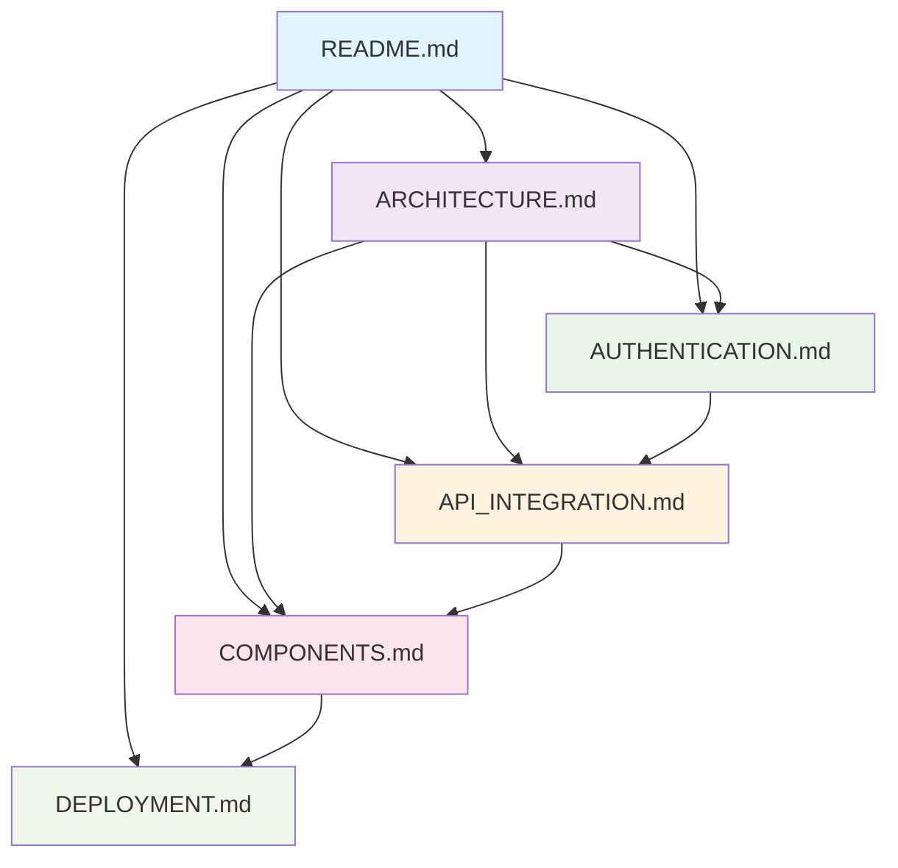

# 📚 Documentation Index - Fast Route Logistics Next.js

## 📋 Tổng quan Documentation

Đây là hệ thống documentation đầy đủ cho dự án Fast Route Logistics Next.js Frontend, bao gồm tất cả thông tin cần thiết để hiểu, phát triển và duy trì ứng dụng.

## 📖 Danh mục Documentation

### 1. 📋 [README.md](../README.md)
**Tổng quan chính và hướng dẫn nhanh**
- Giới thiệu dự án và tính năng
- Tech stack và kiến trúc tổng thể
- Hướng dẫn cài đặt và chạy cơ bản
- Tích hợp với Spring Boot backend
- API endpoints chính
- Cấu trúc thư mục
- Troubleshooting cơ bản

### 2. 🏗️ [ARCHITECTURE.md](./ARCHITECTURE.md)
**Kiến trúc chi tiết và design patterns**
- Component-based architecture
- Data flow patterns
- State management architecture
- Security architecture
- API integration patterns
- Performance architecture
- Testing architecture
- Error handling patterns
- Scalability considerations

### 3. 🔐 [AUTHENTICATION.md](./AUTHENTICATION.md)
**Hệ thống xác thực và phân quyền**
- Email/Password authentication
- Google OAuth integration
- Two-Factor Authentication (2FA)
- JWT token management
- Route protection middleware
- Role-based authorization
- Security best practices
- Error handling
- Authentication testing

### 4. 🌐 [API_INTEGRATION.md](./API_INTEGRATION.md)
**Tích hợp API với Spring Boot backend**
- Backend connection setup
- Authentication APIs
- Order management APIs
- Store management APIs
- User management APIs
- Real-time data synchronization
- Error handling strategies
- Performance monitoring
- API testing approaches

### 5. 🧩 [COMPONENTS.md](./COMPONENTS.md)
**Components và Pages chi tiết**
- Form components (Login, Register, 2FA)
- Page components (Dashboard, Orders, Profile)
- UI utility components
- Component patterns (HOCs, Render Props, Compound)
- State management in components
- Component testing strategies
- Performance optimization

### 6. 🚀 [DEPLOYMENT.md](./DEPLOYMENT.md)
**Deployment và setup production**
- Development environment setup
- Testing configuration
- Build process optimization
- Docker deployment
- Vercel deployment
- Production server setup
- Monitoring and analytics
- Security considerations
- Troubleshooting guides

## 🔗 Mối liên kết giữa các tài liệu



## 🎯 Hướng dẫn đọc theo vai trò

### Cho Developer mới
1. **Bắt đầu**: [README.md](../README.md) - Hiểu tổng quan và setup
2. **Kiến trúc**: [ARCHITECTURE.md](./ARCHITECTURE.md) - Hiểu cấu trúc dự án
3. **Components**: [COMPONENTS.md](./COMPONENTS.md) - Học cách viết components
4. **API**: [API_INTEGRATION.md](./API_INTEGRATION.md) - Hiểu cách tích hợp API

### Cho Lead Developer / Tech Lead
1. **Kiến trúc**: [ARCHITECTURE.md](./ARCHITECTURE.md) - Review design patterns
2. **Security**: [AUTHENTICATION.md](./AUTHENTICATION.md) - Đánh giá bảo mật
3. **Performance**: [API_INTEGRATION.md](./API_INTEGRATION.md) - Tối ưu API calls
4. **Deployment**: [DEPLOYMENT.md](./DEPLOYMENT.md) - Setup production

### Cho DevOps Engineer
1. **Setup**: [README.md](../README.md) - Environment requirements
2. **Build**: [DEPLOYMENT.md](./DEPLOYMENT.md) - Build và deployment process
3. **Monitoring**: [DEPLOYMENT.md](./DEPLOYMENT.md) - Monitoring setup
4. **Security**: [AUTHENTICATION.md](./AUTHENTICATION.md) - Security configurations

### Cho Product Manager / QA
1. **Features**: [README.md](../README.md) - Tính năng và capabilities
2. **User Flow**: [COMPONENTS.md](./COMPONENTS.md) - UI/UX components
3. **Authentication**: [AUTHENTICATION.md](./AUTHENTICATION.md) - User authentication flow
4. **API**: [API_INTEGRATION.md](./API_INTEGRATION.md) - Backend integration

## 📊 Code Examples trong Documentation

### Authentication Flow
```typescript
// Từ AUTHENTICATION.md
const handleLogin = async (credentials: LoginCredentials) => {
  const response = await loginApi(credentials.email, credentials.password)
  const data = await response.json()
  
  if (response.ok) {
    setTokenCookie(data.token)
    onLogin(data)
  }
}
```

### API Integration
```typescript
// Từ API_INTEGRATION.md
export const useOrders = () => {
  return useQuery<Order[]>({
    queryKey: ['orders'],
    queryFn: orderApi.getOrders,
    staleTime: 5 * 60 * 1000,
  })
}
```

### Component Pattern
```typescript
// Từ COMPONENTS.md
export function withAuth<P extends object>(Component: React.ComponentType<P>) {
  return function AuthenticatedComponent(props: P) {
    const { user, loading } = useAuth()
    if (loading) return <LoadingSpinner />
    if (!user) return <Navigate to="/login" replace />
    return <Component {...props} />
  }
}
```

## 🛠️ Tools và Resources

### Development Tools
- **TypeScript**: Type safety và IntelliSense
- **ESLint**: Code quality và consistency
- **Prettier**: Code formatting
- **Husky**: Git hooks
- **Jest**: Unit testing
- **React Testing Library**: Component testing

### Documentation Tools
- **Markdown**: Documentation format
- **Mermaid**: Diagrams và flowcharts
- **JSDoc**: Code documentation
- **Storybook**: Component documentation

### External References
- [Next.js Documentation](https://nextjs.org/docs)
- [React Documentation](https://react.dev)
- [TypeScript Handbook](https://www.typescriptlang.org/docs/)
- [Ant Design Components](https://ant.design/components/overview/)
- [TanStack Query](https://tanstack.com/query/latest)

## 🔄 Cập nhật Documentation

### Quy tắc cập nhật
1. **Accuracy**: Đảm bảo thông tin chính xác và cập nhật
2. **Completeness**: Bao gồm đầy đủ thông tin cần thiết
3. **Clarity**: Viết rõ ràng, dễ hiểu
4. **Examples**: Cung cấp code examples thực tế
5. **Maintenance**: Cập nhật khi có thay đổi code

### Process cập nhật
```bash
# 1. Tạo branch cho documentation
git checkout -b docs/update-authentication

# 2. Cập nhật documentation files
# Edit relevant .md files

# 3. Review và test
# Ensure all links work and examples are valid

# 4. Commit changes
git commit -m "docs: update authentication documentation"

# 5. Create pull request
git push origin docs/update-authentication
```

### Checklist khi cập nhật
- [ ] Kiểm tra tất cả links hoạt động
- [ ] Verify code examples có thể chạy
- [ ] Update version numbers nếu cần
- [ ] Check spelling và grammar
- [ ] Ensure consistent formatting
- [ ] Update index nếu thêm sections mới

## 📞 Support và Contribution

### Báo lỗi Documentation
Nếu phát hiện lỗi hoặc thiếu sót trong documentation:
1. Tạo issue trên GitHub với label `documentation`
2. Mô tả rõ vấn đề và vị trí
3. Đề xuất cách sửa nếu có thể

### Đóng góp Documentation
1. Fork repository
2. Tạo branch cho changes
3. Cập nhật documentation
4. Tạo pull request với mô tả chi tiết

### Review Process
1. **Technical Review**: Kiểm tra tính chính xác technical
2. **Content Review**: Kiểm tra clarity và completeness
3. **Final Approval**: Approval từ maintainers

---

## 📈 Metrics và Analytics

### Documentation Usage
- **Page Views**: Track popular documentation pages
- **Search Queries**: Most searched topics
- **User Feedback**: Ratings và comments
- **Update Frequency**: How often docs are updated

### Improvement Areas
- **Missing Topics**: Gaps in current documentation
- **Outdated Content**: Content that needs updates
- **User Pain Points**: Common questions không covered
- **Example Requests**: More code examples needed

---

Documentation này được duy trì và cập nhật liên tục để đảm bảo tính chính xác và hữu ích cho toàn bộ team phát triển.