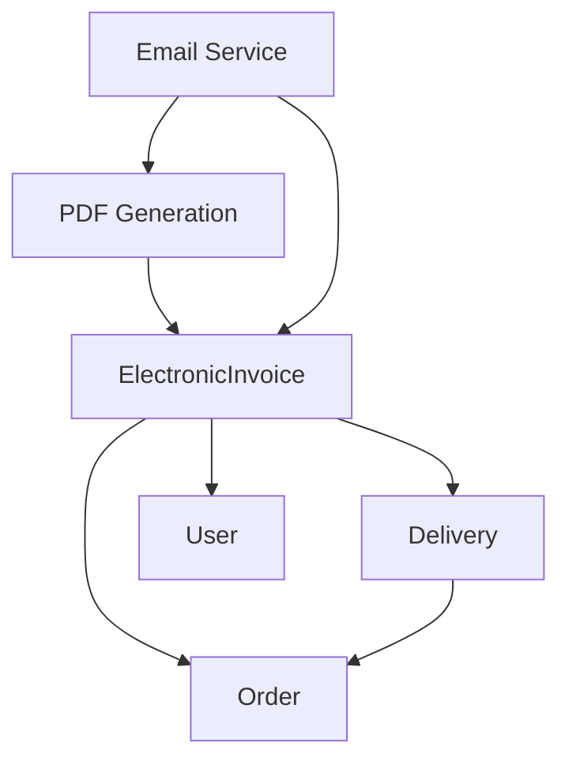

# Hệ thống Hóa đơn Thanh toán KTC Logistics

## 📋 Tổng quan

Hệ thống hóa đơn thanh toán KTC Logistics cung cấp giải pháp hoàn chỉnh để tạo, quản lý và phân phối hóa đơn thanh toán cho các đơn hàng giao hàng đã hoàn thành.

### 🆕 **Cập nhật Phiên bản Mới (v2.1 - 2025-08-24)**

- ✅ **Tích hợp thông tin vận đơn**: Hiển thị mã vận đơn (delivery ID) trên hóa đơn
- ✅ **Nguồn dữ liệu chính xác**: Sử dụng phí giao hàng (delivery_fee) thay vì tổng đơn hàng
- ✅ **PDF thật sự**: Tạo file PDF định dạng chuẩn thay vì HTML
- ✅ **Quan hệ dữ liệu**: ElectronicInvoice → Delivery integration
- ✅ **Mở rộng quyền OPERATIONS**: Role OPERATIONS có quyền truy cập đầy đủ các chức năng hóa đơn
- ✅ **Cải thiện phân quyền**: Bổ sung role permissions matrix chi tiết

---

## 🏗️ Kiến trúc Hệ thống

### **Database Schema**

```sql
-- Bảng hóa đơn thanh toán
CREATE TABLE electronic_invoices (
    id BIGINT PRIMARY KEY AUTO_INCREMENT,
    order_id BIGINT NOT NULL,
    delivery_id BIGINT NOT NULL,  -- 🆕 Quan hệ với delivery
    invoice_number VARCHAR(50) UNIQUE NOT NULL,
    invoice_status ENUM('CREATED', 'SENT', 'DELIVERED', 'CANCELLED', 'EXPIRED'),
    issued_at TIMESTAMP NOT NULL,
    total_amount DECIMAL(15,2) NOT NULL,  -- Lấy từ delivery_fee
    tax_amount DECIMAL(15,2) DEFAULT 0,
    net_amount DECIMAL(15,2) NOT NULL,
    customer_email VARCHAR(255),
    customer_name VARCHAR(255),
    notes TEXT,
    pdf_file_path VARCHAR(500),
    pdf_file_name VARCHAR(255),
    email_sent_at TIMESTAMP NULL,
    created_by BIGINT,
    created_at TIMESTAMP DEFAULT CURRENT_TIMESTAMP,
    updated_at TIMESTAMP DEFAULT CURRENT_TIMESTAMP ON UPDATE CURRENT_TIMESTAMP,
    
    FOREIGN KEY (order_id) REFERENCES orders(id),
    FOREIGN KEY (delivery_id) REFERENCES deliveries(id),  -- 🆕
    FOREIGN KEY (created_by) REFERENCES users(id)
);

-- Bảng deliveries (yêu cầu có dữ liệu)
CREATE TABLE deliveries (
    id BIGINT PRIMARY KEY AUTO_INCREMENT,
    order_id BIGINT NOT NULL,
    delivery_fee DECIMAL(15,2) NOT NULL,  -- 🎯 Nguồn cho total_amount
    -- ... other delivery fields
);
```

### **Entity Relationships**



---

## 🔧 API Documentation

### **Base URL**
```
http://localhost:8080/api/invoices
```

### **Authentication**
Tất cả endpoint yêu cầu JWT token:
```http
Authorization: Bearer <your_jwt_token>
```

### **Endpoints**

#### **1. Kiểm tra điều kiện tạo hóa đơn**

```http
GET /api/invoices/check-eligibility/{orderId}
```

**Authorization:** `ADMIN`, `DISPATCHER`, `OPERATIONS`

**Response:**
```json
{
    "success": true,
    "data": {
        "orderId": 1,
        "eligible": true,
        "message": "Đơn hàng đủ điều kiện xuất hóa đơn"
    }
}
```

**Điều kiện:**
- ✅ Order tồn tại và đã hoàn thành
- ✅ Có delivery data với delivery_fee > 0
- ✅ Chưa có hóa đơn trước đó
- ✅ Trong thời hạn xuất hóa đơn (365 ngày)

#### **2. Tạo hóa đơn thanh toán**

```http
POST /api/invoices
```

**Authorization:** `ADMIN`, `DISPATCHER`, `OPERATIONS`

**Request Body:**
```json
{
    "orderId": 1,
    "customerEmail": "customer@example.com",
    "customerName": "Nguyễn Văn A",
    "notes": "Ghi chú đặc biệt"
}
```

**Response:**
```json
{
    "success": true,
    "message": "Tạo hóa đơn thanh toán thành công",
    "data": {
        "id": 5,
        "orderId": 1,
        "deliveryId": 1,                    // 🆕 Mã vận đơn
        "invoiceNumber": "INV-20250824-123456-003",
        "invoiceStatus": "CREATED",
        "totalAmount": 50000,               // 🆕 Từ delivery_fee
        "taxAmount": 5000,
        "netAmount": 45000,
        "customerEmail": "customer@example.com",
        "customerName": "Nguyễn Văn A",
        "pdfFilePath": "invoices/pdfs/invoice_INV-20250824-123456-003_xxx.pdf",
        "pdfFileName": "invoice_INV-20250824-123456-003_xxx.pdf",
        "issuedAt": "2025-08-24T12:34:56.789Z",
        "createdByName": "Admin User"
    }
}
```

#### **3. Tải xuống PDF**

```http
GET /api/invoices/{invoiceId}/download-pdf
```

**Authorization:** `ADMIN`, `OPERATIONS`, `DISPATCHER`, `CUSTOMER`

**Response:**
```http
Content-Type: application/pdf
Content-Disposition: attachment; filename="HoaDon_INV-20250824-123456-003.pdf"

[PDF Binary Data]
```

#### **4. Gửi email hóa đơn**

```http
POST /api/invoices/{invoiceId}/send-email?emailAddress=recipient@example.com
```

**Authorization:** `ADMIN`, `OPERATIONS`, `DISPATCHER`

**Response:**
```json
{
    "success": true,
    "message": "Gửi hóa đơn qua email thành công"
}
```

#### **5. Lấy chi tiết hóa đơn**

```http
GET /api/invoices/{invoiceId}
```

**Authorization:** `ADMIN`, `OPERATIONS`, `DISPATCHER`, `CUSTOMER`

#### **6. Danh sách hóa đơn**

```http
GET /api/invoices
```

**Authorization:** `ADMIN`, `OPERATIONS`, `DISPATCHER`, `CUSTOMER`

#### **7. Lấy hóa đơn theo Order ID**

```http
GET /api/invoices/by-order/{orderId}
```

**Authorization:** `ADMIN`, `OPERATIONS`, `DISPATCHER`, `CUSTOMER`

#### **8. Tạo file PDF cho hóa đơn**

```http
POST /api/invoices/{invoiceId}/generate-pdf
```

**Authorization:** `ADMIN`, `DISPATCHER`, `OPERATIONS`, `CUSTOMER`

#### **9. Lấy danh sách đơn hàng cần xuất hóa đơn**

```http
GET /api/invoices/orders-needing-invoice
```

**Authorization:** `ADMIN`, `DISPATCHER`, `OPERATIONS`

#### **10. Hủy hóa đơn**

```http
POST /api/invoices/{invoiceId}/cancel
```

**Authorization:** `ADMIN` (chỉ Admin mới có quyền hủy)

**Request Body:**
```json
{
    "cancellationReason": "Lý do hủy hóa đơn"
}
```

---

## 📄 Nội dung Hóa đơn

### **Thông tin hiển thị trên PDF**

| **Mục** | **Nguồn dữ liệu** | **Ghi chú** |
|---------|------------------|-------------|
| **Header** |  |  |
| Tiêu đề | "HÓA ĐƠN THANH TOÁN" | Cố định |
| Công ty | "KTC LOGISTICS" | Cố định |
| **Thông tin hóa đơn** |  |  |
| Số hóa đơn | `invoice_number` | Format: INV-YYYYMMDD-HHMMSS-XXX |
| Ngày xuất | `issued_at` | Timestamp tạo hóa đơn |
| Mã đơn hàng | `order.id` | ID đơn hàng |
| **🆕 Mã vận đơn** | `delivery.id` | **Thông tin mới** |
| Khách hàng | `customer_name` | Tùy chọn |
| Email | `customer_email` | Tùy chọn |
| **Chi tiết tài chính** |  |  |
| **🆕 Tổng giá trị** | `delivery.delivery_fee` | **Nguồn mới** |
| Thuế VAT (10%) | `tax_amount` | Tự động tính |
| Thành tiền | `net_amount` | Sau trừ thuế |
| Ghi chú | `notes` | Tùy chọn |
| **Footer** |  |  |
| Thông tin cảm ơn | Text cố định | KTC Logistics |

### **Sample PDF Layout**

```
┌─────────────────────────────────────────────────┐
│                HÓA ĐƠN THANH TOÁN                   │
│                KTC LOGISTICS                    │
├─────────────────────────────────────────────────┤
│ Số hóa đơn:    INV-20250824-123456-003        │
│ Ngày xuất:     24/08/2025 12:34                │
│ Mã đơn hàng:   1                               │
│ 🆕 Mã vận đơn: 1                               │
│ Khách hàng:    Nguyễn Văn A                    │
│ Email:         customer@example.com            │
├─────────────────────────────────────────────────┤
│ Chi tiết hóa đơn:                              │
│                                                │
│ Mô tả                     │ Số tiền            │
│ Tổng giá trị đơn hàng    │ 50,000 VND        │
│ Thuế VAT (10%)           │ 5,000 VND         │
│ Thành tiền               │ 45,000 VND        │
├─────────────────────────────────────────────────┤
│ Ghi chú: Giao hàng thành công                  │
├─────────────────────────────────────────────────┤
│      Hóa đơn thanh toán từ hệ thống KTC           │
│    Cảm ơn quý khách đã sử dụng dịch vụ!       │
└─────────────────────────────────────────────────┘
```

---

## 🛠️ Implementation Details

### **Service Layer Architecture**

```java
@Service
public class InvoiceService {
    
    @Autowired
    private DeliveryRepository deliveryRepository;  // 🆕
    
    public ElectronicInvoice createInvoice(Long orderId, Long userId, 
                                         String customerEmail, String customerName) {
        // 1. Validate order eligibility
        ValidationResult validation = validateInvoiceEligibility(orderId);
        
        // 2. 🆕 Get delivery data
        List<Delivery> deliveries = deliveryRepository.findByOrderId(orderId);
        Delivery delivery = deliveries.get(0);
        
        // 3. 🆕 Use delivery fee as total amount
        BigDecimal totalAmount = delivery.getDeliveryFee();
        
        // 4. Create invoice with delivery relationship
        ElectronicInvoice invoice = new ElectronicInvoice(order, delivery, 
                                                        invoiceNumber, totalAmount, user);
        
        // 5. Calculate tax and save
        invoice.calculateTax();
        ElectronicInvoice saved = invoiceRepository.save(invoice);
        
        // 6. 🆕 Auto-generate real PDF
        generateInvoicePdf(saved.getId());
        
        return saved;
    }
}
```

### **PDF Generation Service**

```java
@Service
public class PdfGenerationService {
    
    public void generatePdfFromInvoice(ElectronicInvoice invoice, File outputFile) {
        Document document = new Document(PageSize.A4, 50, 50, 50, 50);
        PdfWriter writer = PdfWriter.getInstance(document, new FileOutputStream(outputFile));
        
        document.open();
        addInvoiceContentToPdf(document, invoice);  // 🆕 With delivery info
        document.close();
    }
    
    private void addInvoiceContentToPdf(Document document, ElectronicInvoice invoice) {
        // Add delivery ID and use delivery fee
        infoTable.addCell(new Cell(new Phrase("Mã vận đơn:", boldFont)));
        infoTable.addCell(new Cell(new Phrase(invoice.getDelivery().getId().toString(), normalFont)));
        
        // Use delivery fee for total amount
        detailTable.addCell(new Cell(new Phrase("Tổng giá trị đơn hàng", normalFont)));
        detailTable.addCell(new Cell(new Phrase(formatCurrency(invoice.getDelivery().getDeliveryFee()), normalFont)));
    }
}
```

---

## 🧪 Testing Guide

### **Postman Collection Setup**

#### **Environment Variables**
```json
{
  "baseUrl": "http://localhost:8080",
  "adminEmail": "admin@ktc.com",
  "adminPassword": "password",
  "testEmail": "test@example.com",
  "testOrderId": "1",
  "authToken": ""
}
```

#### **Test Scenarios**

##### **1. Happy Path Test**
```bash
1. POST /api/auth/login → Get token
2. GET /api/invoices/check-eligibility/1 → Verify order eligible
3. POST /api/invoices → Create invoice
4. GET /api/invoices/{id}/download-pdf → Download PDF
5. POST /api/invoices/{id}/send-email → Send email
```

##### **2. Error Scenarios**
```bash
# No delivery data
POST /api/invoices with orderId=999
→ Expected: 400 "Không tìm thấy thông tin giao hàng"

# No delivery fee
POST /api/invoices with order having delivery_fee=0
→ Expected: 400 "Phí giao hàng chưa được thiết lập"

# Already has invoice
POST /api/invoices with order already having invoice
→ Expected: 400 "Order already has an electronic invoice"
```

### **Database Test Data**

```sql
-- Setup test order
INSERT INTO orders (id, description, total_amount, created_at) 
VALUES (1, 'Test Order', 100000, NOW());

-- Setup test delivery with fee 🆕
INSERT INTO deliveries (id, order_id, delivery_fee, vehicle_id, created_at) 
VALUES (1, 1, 50000, 1, NOW());

-- Setup test user
INSERT INTO users (id, username, email, password_hash, role_id) 
VALUES (1, 'admin', 'admin@ktc.com', '$2a$10$...', 1);
```

---

## 🚨 Troubleshooting

### **Common Issues**

#### **1. "Không tìm thấy thông tin giao hàng"**
```sql
-- Check delivery data
SELECT * FROM deliveries WHERE order_id = ?;

-- Create if missing
INSERT INTO deliveries (order_id, delivery_fee, vehicle_id) 
VALUES (1, 50000, 1);
```

#### **2. "Phí giao hàng chưa được thiết lập"**
```sql
-- Update delivery fee
UPDATE deliveries SET delivery_fee = 50000 WHERE order_id = 1;
```

#### **3. PDF không tạo được**
```bash
# Check directory permissions
mkdir -p invoices/pdfs
chmod 755 invoices/pdfs

# Check dependencies
grep -i "openpdf\|itext" build.gradle
```

#### **4. Email không gửi được**
```properties
# Check email configuration
spring.mail.host=smtp.gmail.com
spring.mail.port=587
spring.mail.username=your-email@gmail.com
spring.mail.password=your-app-password
```

### **Debug Commands**

```bash
# Check application logs
tail -f logs/spring-project.log | grep -i invoice

# Check database
mysql -u root -p ktc_logistics
> SELECT i.*, d.delivery_fee, o.description 
  FROM electronic_invoices i 
  JOIN deliveries d ON i.delivery_id = d.id 
  JOIN orders o ON i.order_id = o.id;

# Check PDF files
ls -la invoices/pdfs/
file invoices/pdfs/*.pdf  # Should show "PDF document"
```

---

## 📊 Performance & Monitoring

### **Key Metrics**

- **Invoice Creation Time**: < 2 seconds
- **PDF Generation Time**: < 5 seconds  
- **Email Delivery Time**: < 10 seconds
- **Database Query Performance**: < 100ms average

### **Monitoring Endpoints**

```http
GET /actuator/health
GET /actuator/metrics/invoice.creation.time
GET /actuator/metrics/pdf.generation.time
```

### **Logging Configuration**

```properties
logging.level.ktc.spring_project.services.InvoiceService=DEBUG
logging.level.ktc.spring_project.services.PdfGenerationService=DEBUG
logging.level.ktc.spring_project.services.EmailService=INFO
```

---

## 🔒 Security Considerations

### **Authorization**

#### **Role Permissions Matrix**

| **Endpoint** | **ADMIN** | **DISPATCHER** | **OPERATIONS** | **CUSTOMER** |
|--------------|-----------|----------------|----------------|--------------|
| Check Eligibility | ✅ | ✅ | ✅ | ❌ |
| Create Invoice | ✅ | ✅ | ✅ | ❌ |
| List Invoices | ✅ | ✅ | ✅ | ✅ |
| Get Invoice Details | ✅ | ✅ | ✅ | ✅ |
| Get Invoice by Order | ✅ | ✅ | ✅ | ✅ |
| Send Email | ✅ | ✅ | ✅ | ❌ |
| Generate PDF | ✅ | ✅ | ✅ | ✅ |
| Download PDF | ✅ | ✅ | ✅ | ✅ |
| Orders Needing Invoice | ✅ | ✅ | ✅ | ❌ |
| Cancel Invoice | ✅ | ❌ | ❌ | ❌ |

#### **Key Points**
- ✅ ADMIN, DISPATCHER và OPERATIONS có quyền tạo hóa đơn
- ✅ OPERATIONS có quyền truy cập đầy đủ các chức năng hóa đơn (trừ hủy hóa đơn)
- ✅ CUSTOMER có quyền xem, tải PDF và tạo PDF hóa đơn
- ✅ CUSTOMER không có quyền gửi email hóa đơn
- ✅ Chỉ ADMIN có quyền hủy hóa đơn
- ✅ JWT token validation cho tất cả endpoints
- ✅ Rate limiting cho API calls

### **Data Validation**
- ✅ Input sanitization cho customer info
- ✅ Email format validation
- ✅ Amount validation (> 0)
- ✅ File path sanitization

### **Audit Trail**
- ✅ Log tất cả invoice operations
- ✅ Track user actions với timestamps
- ✅ Store PDF file paths securely

---

## 🚀 Deployment

### **Production Checklist**

- [ ] Database migration scripts applied
- [ ] Email SMTP configuration
- [ ] PDF storage directory permissions
- [ ] SSL certificates for HTTPS
- [ ] Environment variables set
- [ ] Log rotation configured
- [ ] Backup strategy implemented

### **Environment Configuration**

```properties
# Production settings
spring.profiles.active=production
invoice.pdf.storage.path=/var/invoices/pdfs
spring.mail.host=smtp.company.com
logging.level.root=WARN
logging.level.ktc.spring_project=INFO
```

---

## 📈 Future Enhancements

### **Planned Features**

1. **🔄 Bulk Invoice Generation**
   - Tạo nhiều hóa đơn cùng lúc
   - Background job processing

2. **📱 Mobile API**
   - REST API cho mobile app
   - Push notifications

3. **🧾 Invoice Templates**
   - Multiple PDF templates
   - Custom branding options

4. **📊 Analytics Dashboard**
   - Invoice statistics
   - Revenue reporting

5. **🔄 Integration APIs**
   - Third-party accounting systems
   - Government e-invoice submission

---

## 📞 Support

### **Development Team**
- **Backend Lead**: Spring Boot & Database
- **Frontend Lead**: API Integration
- **DevOps**: Deployment & Monitoring

### **Documentation Links**
- [API Documentation](./API_DOCUMENTATION.md)
- [Database Schema](./DATABASE_SCHEMA.md)
- [Postman Collection](./KTC_Email_Invoice_Test_Collection_Updated.postman_collection.json)

---

**© 2025 KTC Logistics - Electronic Invoice System v2.1**

*Last Updated: August 24, 2025*
